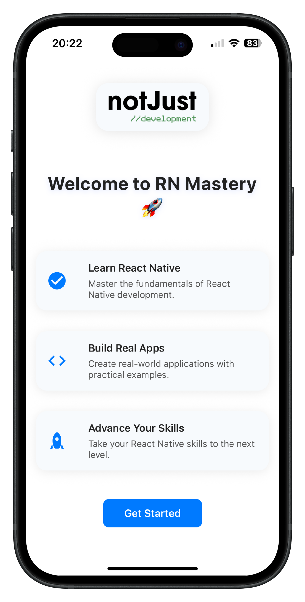

# React Native Onboarding App

> This project showcases a simple onboarding experience built with React Native and Expo.


## Onboarding App



## Features

- Animated banner and button interactions
- Modern card-style feature rows with MaterialCommunityIcons
- Responsive and accessible design
- Easy to customize and extend

## Getting Started

### Prerequisites

- [Node.js](https://nodejs.org/)
- [Expo CLI](https://docs.expo.dev/get-started/installation/)
- [Yarn](https://yarnpkg.com/) or [npm](https://www.npmjs.com/)

### Installation

1. **Clone the repository:**

   ```sh
   git clone https://github.com/thepembeweb/onboarding.git
   cd onboarding
   ```

2. **Install dependencies:**

   ```sh
   yarn install
   # or
   npm install
   ```

3. **Start the Expo development server:**

   ```sh
   expo start
   ```

4. **Run on your device or simulator:**
   - Scan the QR code with Expo Go (iOS/Android)
   - Or press `i` for iOS simulator, `a` for Android emulator

### Customization

- **Banner Image:** Replace `assets/logo.png` with your own logo.
- **Feature Rows:** Edit `components/ContentSection.tsx` to change the features.
- **Colors & Styles:** Tweak styles in each component for your brand.

### Folder Structure

```plaintext
components/
  Banner.tsx
  ContentSection.tsx
  FeatureRow.tsx
  Footer.tsx
  Welcome.tsx
assets/
  adaptive-icon.png
  favicon.png
  icon.png
  logo.png
  splash-icon.png
App.tsx
```

## Built With

- [React Native](https://reactnative.dev/) - The mobile framework used
- [Expo](https://expo.dev/) - The platform used to build the universal app
- [Tyescript](https://www.typescriptlang.org/) - The programming language used
- [Node](https://nodejs.org) - Javascript Runtime

## Authors

- **[Pemberai Sweto](https://github.com/thepembeweb)** - _Initial work_ - [Onboarding](https://github.com/thepembeweb/onboarding)
